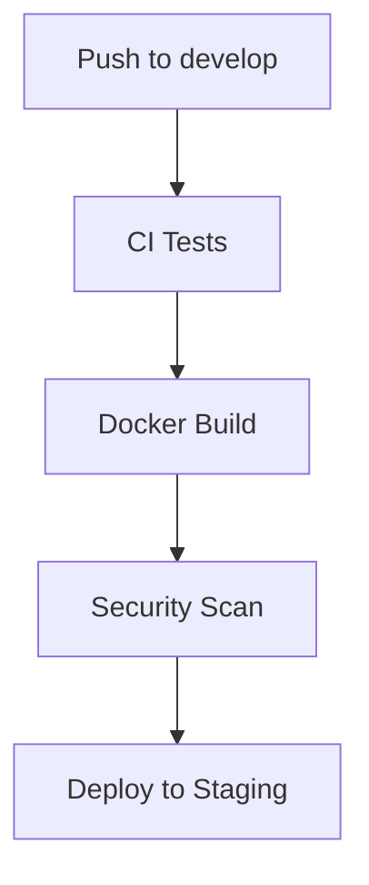
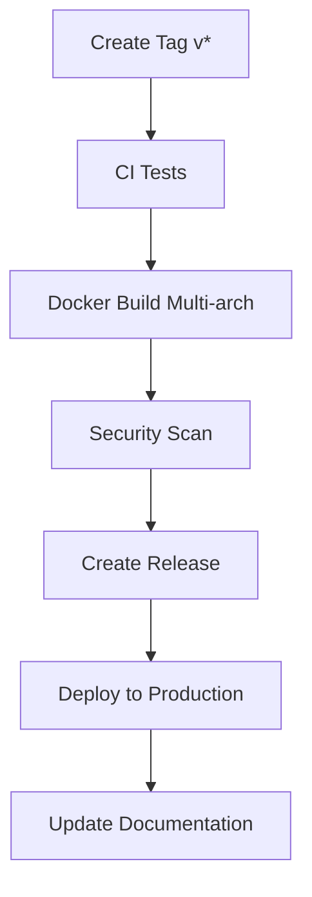
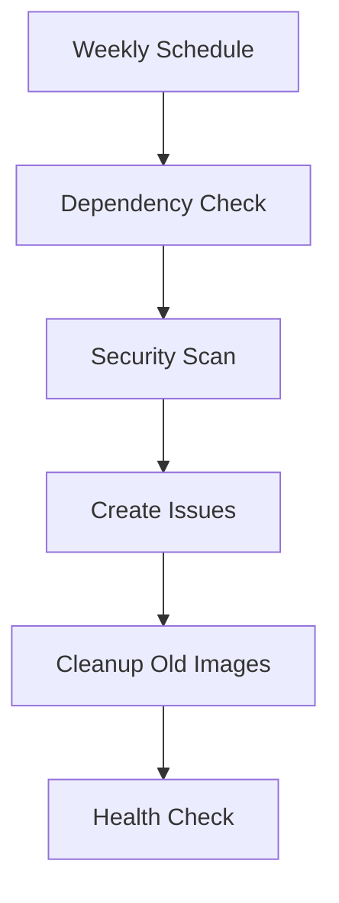

# 🚀 GitHub Actions Workflows

## Workflows Configurados

### 1. 🐳 **Docker Build & Push** (`docker-build.yml`)

**Triggers:**
- Push a `main` y `develop`
- Tags `v*`
- Pull requests a `main`
- Manual dispatch

**Features:**
- ✅ **Multi-architecture builds** (amd64, arm64)
- ✅ **GitHub Container Registry** (ghcr.io)
- ✅ **Layer caching** optimizado
- ✅ **Security scanning** con Trivy
- ✅ **SBOM generation** para compliance
- ✅ **Automated deployment** staging/production

**Image Tags Generated:**
```bash
# Branch-based
ghcr.io/rafnixg/sismosve:main
ghcr.io/rafnixg/sismosve:develop

# Version tags
ghcr.io/rafnixg/sismosve:v1.0.0
ghcr.io/rafnixg/sismosve:v1.0
ghcr.io/rafnixg/sismosve:v1

# Special tags
ghcr.io/rafnixg/sismosve:latest
ghcr.io/rafnixg/sismosve:20250925-143022
ghcr.io/rafnixg/sismosve:main-sha256
```

### 2. 🧪 **CI/CD Pipeline** (`ci.yml`)

**Triggers:**
- Push a `main` y `develop`
- Pull requests a `main`

**Jobs:**
- **test**: Tests con múltiples versiones Python (3.9, 3.10, 3.11)
- **code-quality**: Linting con Black, isort, Bandit, Safety
- **docker-test**: Testing de la imagen Docker
- **notify**: Notificaciones de estado

**Quality Checks:**
- ✅ **Black** - Code formatting
- ✅ **isort** - Import sorting
- ✅ **Bandit** - Security analysis
- ✅ **Safety** - Dependency vulnerabilities
- ✅ **Flake8** - Style guide enforcement

### 3. 📦 **Release Automation** (`release.yml`)

**Triggers:**
- Tags `v*` (ej: `v1.0.0`, `v2.1.3`)

**Features:**
- ✅ **Changelog automático** desde git commits
- ✅ **Release notes** generadas
- ✅ **Artifacts** incluidos (docker-compose.yml, nginx.conf)
- ✅ **Documentation updates**
- ✅ **Pre-release detection** (alpha, beta, rc)

**Release Assets:**
- `docker-compose.yml`
- `nginx.conf`
- `requirements.txt`
- Auto-generated changelog

### 4. 🛠️ **Maintenance** (`maintenance.yml`)

**Triggers:**
- Scheduled: Domingos 2:00 AM UTC
- Manual dispatch

**Jobs:**
- **dependency-check**: Security & updates check
- **cleanup-packages**: Old image cleanup
- **health-check**: Latest image testing

**Automated Tasks:**
- ✅ **Security vulnerability** scanning
- ✅ **Outdated dependencies** detection
- ✅ **Docker image cleanup** (keep last 10)
- ✅ **Health checks** on latest builds
- ✅ **Maintenance issues** creation

### 5. 🤖 **Dependabot** (`dependabot.yml`)

**Schedules:**
- **Python deps**: Lunes 9:00 AM
- **Docker images**: Martes 9:00 AM  
- **GitHub Actions**: Miércoles 9:00 AM

**Configuration:**
- ✅ **Smart ignores** para major updates críticos
- ✅ **Automatic assignment**
- ✅ **Labeled PRs** por categoría
- ✅ **Semantic commit** messages

## 🏃‍♂️ Workflow Execution Flow

### Development Workflow:


### Release Workflow:


### Maintenance Workflow:


## 🎯 Usage Examples

### Creating a Release:
```bash
# Create and push a tag
git tag v1.2.0
git push origin v1.2.0

# This triggers:
# 1. Full CI pipeline
# 2. Multi-arch Docker build
# 3. Security scanning
# 4. Release creation
# 5. Documentation updates
```

### Using Built Images:
```bash
# Latest stable
docker pull ghcr.io/rafnixg/sismosve:latest

# Specific version
docker pull ghcr.io/rafnixg/sismosve:v1.2.0

# Development
docker pull ghcr.io/rafnixg/sismosve:develop
```

### Manual Workflow Dispatch:
```bash
# Via GitHub CLI
gh workflow run docker-build.yml

# Via GitHub UI
# Repository > Actions > Select workflow > Run workflow
```

## 🔒 Security Features

### Container Registry:
- ✅ **Private registry** (ghcr.io)
- ✅ **Token-based auth** (GITHUB_TOKEN)
- ✅ **Multi-arch support**
- ✅ **Vulnerability scanning**

### Security Scanning:
- ✅ **Trivy** - Container vulnerabilities
- ✅ **Bandit** - Python security issues
- ✅ **Safety** - Dependency vulnerabilities
- ✅ **SARIF upload** to GitHub Security tab

### Permissions:
- ✅ **Least privilege** principle
- ✅ **Read-only** by default
- ✅ **Explicit write** permissions
- ✅ **Package write** only when needed

## 📊 Monitoring & Notifications

### Success Notifications:
- ✅ **Build completion**
- ✅ **Release creation**
- ✅ **Deployment status**
- ✅ **Security scan results**

### Failure Handling:
- ✅ **Automatic failure** detection
- ✅ **Detailed error** logging
- ✅ **Artifact collection**
- ✅ **Issue creation** for maintenance

### Metrics Available:
- **Build times** - Workflow execution duration
- **Success rates** - Pass/fail ratios
- **Image sizes** - Docker image optimization
- **Security scores** - Vulnerability counts

## 🔧 Configuration

### Environment Variables:
```yaml
REGISTRY: ghcr.io
IMAGE_NAME: ${{ github.repository }}
PYTHONPATH: /app
PYTHONUNBUFFERED: 1
```

### Secrets Required:
- `GITHUB_TOKEN` - Automático (GitHub provided)

### Repository Settings:
- ✅ **Actions enabled**
- ✅ **Packages enabled**  
- ✅ **Security alerts** enabled
- ✅ **Dependabot** enabled

## 🚀 Getting Started

### 1. Enable Workflows:
```bash
# Push to trigger first run
git add .github/
git commit -m "ci: add GitHub Actions workflows"
git push origin main
```

### 2. Create First Release:
```bash
git tag v1.0.0
git push origin v1.0.0
```

### 3. Monitor Execution:
- Go to **Actions** tab in GitHub
- Check workflow runs
- Review security alerts
- Monitor package registry

### 4. Use Built Images:
```bash
# Pull and run
docker pull ghcr.io/rafnixg/sismosve:latest
docker run -p 8000:8000 ghcr.io/rafnixg/sismosve:latest
```

---

**🎯 Ready for CI/CD!** Tu proyecto SismosVE tiene un pipeline completo de integración y despliegue continuo con GitHub Actions.